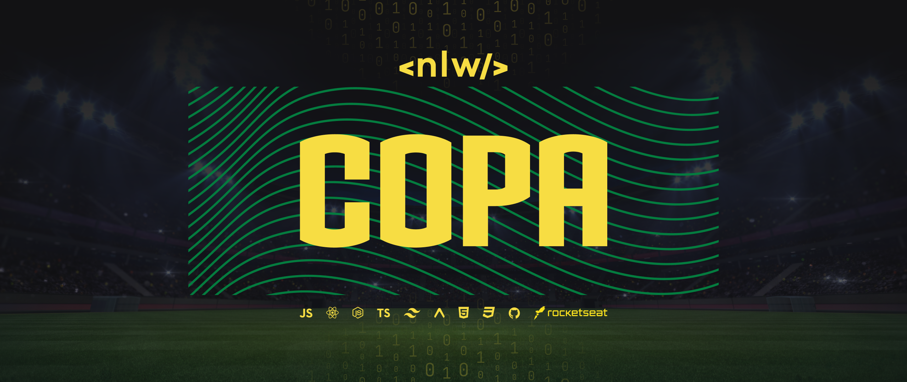
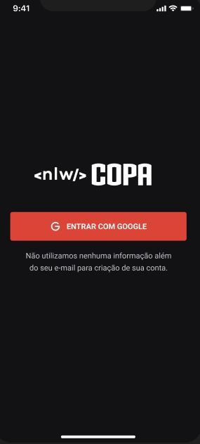
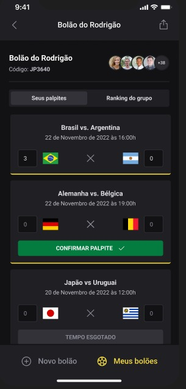
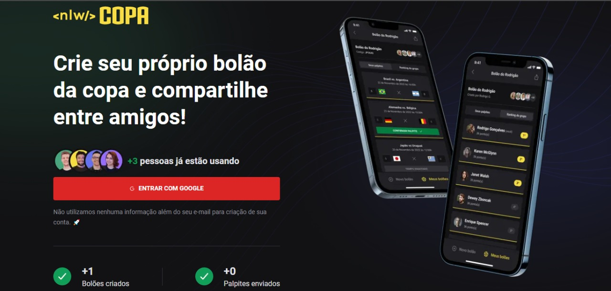
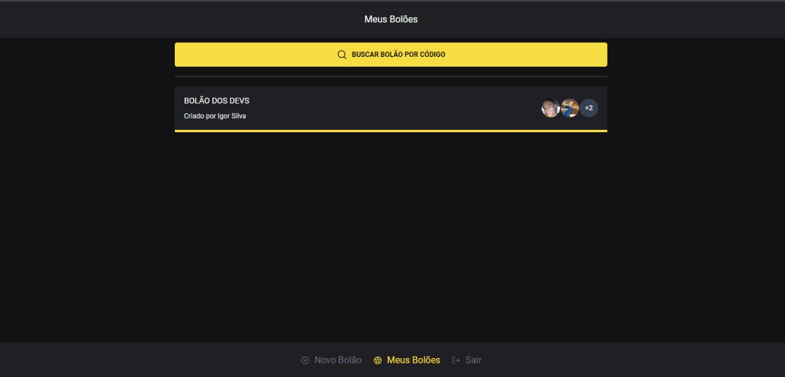
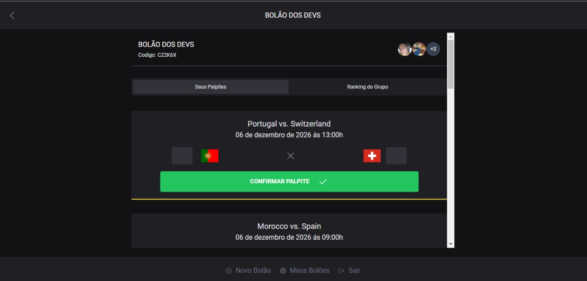

<div align="center">

</div>

<h1>O projeto</h1>
Durante a semana de Next Level Week foi desenvolvida uma aplicação de bolões da copa do mundo. A aplicação consiste em aplicativo mobile, que o usuario pode criar seus bolões, partipar de outros bolões e palpitar os jogos dos bolões que ele esta participando.

<br>

> Um adicional que me permitir fazer foi a versão Web que não foi desenvolvida na semana da NLW

<br>

<h1>🧪Tecnologias Usadas</h1>

- [NodeJS](https://nodejs.org/en/)
- [Fastify](https://www.fastify.io/)
- [NextJS](https://nextjs.org/)
- [ReactNative](https://reactnative.dev/)
- [Expo](https://expo.dev/)
- [Tailwind](https://tailwindcss.com/)
- [TypeScript](https://www.typescriptlang.org/)
- [PrismaORM](https://www.prisma.io/)
- [SQLITE](https://www.sqlite.org/index.html)
- [Zod](https://github.com/colinhacks/zod)
- [Native Base](https://nativebase.io/)

<br>

<h1>Algumas Imagens do projeto</h1>

**Mobile (React Native)**:

<div style="display: flex; gap: 10px; align-items: center; justify-content: center; margin-bottom: 50px;">
     
     
     
     
     
</div>

**Web (NextJS) (para mais imagens vá na pasta images que esta na raiz)** :

<div style="display: flex; gap: 10px; align-items: center; justify-content: center; margin-bottom: 10px;">
     
     
     
</div>

<br>

🎉Como Usar:

### Clonar o Projeto

```sh
$ git https://github.com/IgorSilvaZZ/nlw-copa
$ cd ignite-lab-nodejs
```

### Instalar dependencias Server

```sh
$ cd server
$ npm i
```

### Instalar dependencias Mobile

```sh
$ cd mobile
$ npm i
```

### Instalar dependencias Web

```sh
$ cd web
$ npm i
```

### Rodar projeto

```sh
$ cd server
$ npm run start:dev
```

```sh
$ cd mobile
$ expo
```

```sh
$ cd web
$ npm run dev
```

<br>

<h1>🧾Sobre</h1>

As aulas foram ministradas por \*\*[Diego Fernandes](https://github.com/diego3g) CTO da [Rockeseat](https://rocketseat.com.br/) e [Rodrigo Gonçalves](https://github.com/rodrigorgtic) Educator da [Rockeseat](https://rocketseat.com.br/)
